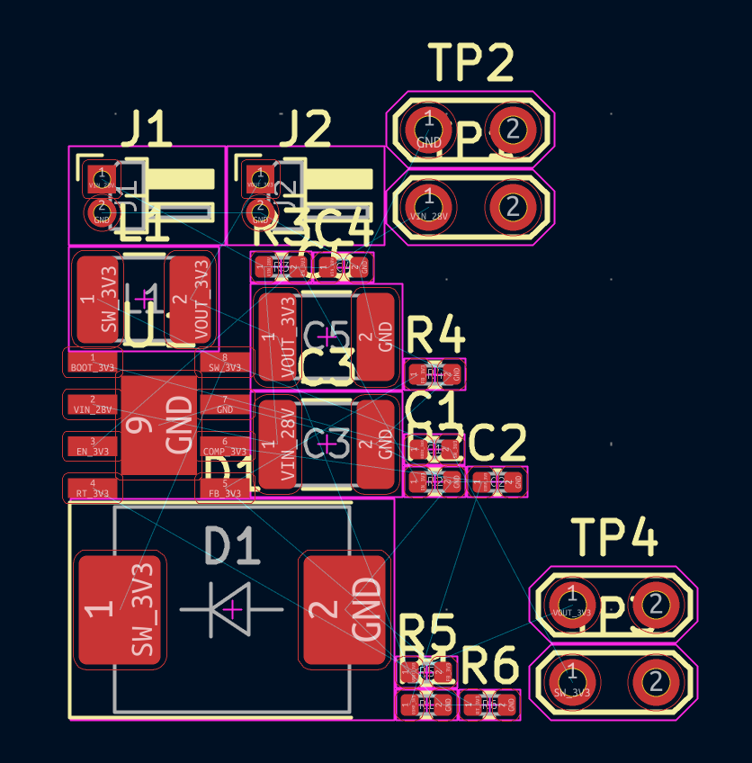
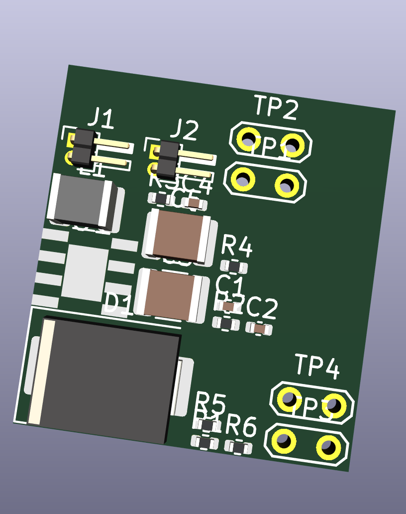
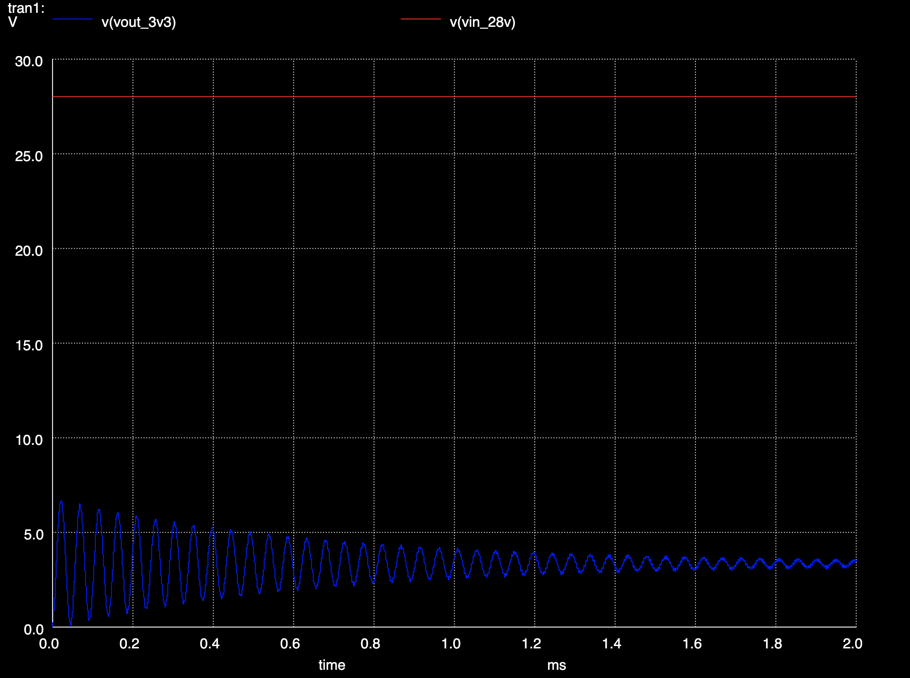

# Programmable 28V to 3.3V Buck Power Board for Avionics Applications

This project implements a 28V to 3.3V buck regulator board using the TPS54340 and the Diode PCB DSL toolchain. The design was motivated by rocketry avionics style power distribution, where higher voltage rails often need to be stepped down for embedded electronics and control hardware. The repository includes the board definition, custom footprints, and an ngspice based simulation flow used to validate startup and switching behavior.

## Schematic View

## Layout View

The current layout captures the board structure and component integration, though routing and final placement optimization were not the focus of this stage.

## Simulation

A simplified transient simulation was performed using ngspice to verify key aspects of the buck converter behavior.

Because the TPS54340 regulator was implemented as a custom component inside the programmable board description, full device level SPICE modeling was not immediately available. As a result, the simulation focuses on validating the surrounding power stage and switching behavior rather than modeling the complete internal regulator dynamics.

The simulated circuit therefore includes the input source, switching behavior, LC output network, and load conditions that approximate the expected converter operation. This allows the simulation to capture the most important observable characteristics of the design such as startup behavior and output settling.

### Input and Output Voltage

The output waveform shows the expected startup transient before settling near the target output voltage. The switch node toggles between approximately 0V and the input rail, which is consistent with normal buck converter operation.

This simplified simulation was sufficient to quickly verify the existing power stage design before further PCB refinement.

## Project Motivation

This board was inspired by power conversion needs commonly seen in rocketry avionics systems, where a higher voltage supply must be converted into a regulated low voltage rail for onboard electronics. The design focuses on implementing a compact 28V to 3.3V switching supply and validating its behavior through simulation before further PCB refinement.

## Development Workflow

An interesting part of this project was experimenting with AI assisted engineering tools during the design process.

I used Claude Code while working with the Diode Computer PCB DSL to recreate the architecture of an existing power board used in a rocketry avionics project. The original board design, simulation, and validation process took several weeks to complete during the hardware development cycle. Using Claude Code as an interactive assistant, I was able to reproduce the overall structure of the board definition and simulation setup in a much shorter time frame.

Over the course of a few days I iteratively prompted the tool for roughly two hours each day, gradually refining the board description, component connections, and simulation setup. The tool was particularly helpful in navigating the Diode DSL toolchain and generating the boilerplate needed for the board definition.

One useful capability was the ability to integrate custom components. In this case I defined my own regulator component for the TPS54340 and connected it into the programmable board description alongside standard passive components from the library.

Overall the workflow allowed me to rapidly prototype a programmable representation of the power board and validate parts of the design using simulation.
